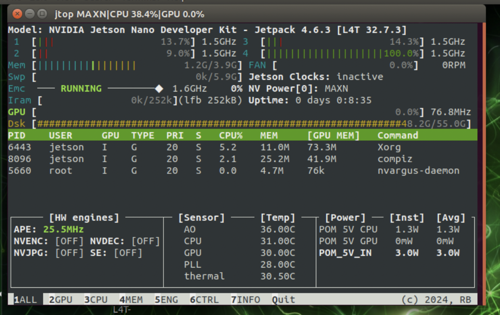

# Secondary System Setup

We currently only have guides available for Jetson board, and we look forward to add more possibilities and varieties such as Raspberry pi in the future.
## Nvidia Jetson board series

# 1. Image flash
| Jetson Module              | Default JetPack Version (at launch) | Default Ubuntu Version  | Default Python 3 Version |
| -------------------------- | ----------------------------------- | ----------------------- | ------------------------ |
| **Jetson Nano**            | JetPack 4.2                         | Ubuntu 18.04 (L4T 32.x) | Python 3.6               |
| **Jetson TX1**             | JetPack 2.2 / 3.3 (older)           | Ubuntu 16.04            | Python 3.5               |
| **Jetson TX2**             | JetPack 3.0 → 4.6.4                 | Ubuntu 16.04 → 18.04    | Python 3.5 → 3.6         |
| **Jetson Xavier NX**       | JetPack 4.4                         | Ubuntu 18.04 (L4T 32.x) | Python 3.6               |
| **Jetson AGX Xavier**      | JetPack 4.1                         | Ubuntu 18.04            | Python 3.6               |
| **Jetson Xavier NX (8GB)** | JetPack 4.6.1 → 5.x                 | Ubuntu 18.04 → 20.04    | Python 3.6 → 3.8         |
| **Jetson Orin Nano**       | JetPack 5.1                         | Ubuntu 20.04 (L4T 35.x) | Python 3.8               |
| **Jetson Orin NX**         | JetPack 5.1                         | Ubuntu 20.04            | Python 3.8               |
| **Jetson AGX Orin**        | JetPack 5.0                         | Ubuntu 20.04            | Python 3.8               |

other specific jetson parameters in https://developer.nvidia.com/embedded/jetson-modules

To use your board, you will need to have an image installed in your board.

An $image$ is a fundamental pre-built system customized to run on specific hardware or software requirements.

You can flash your image either through manual download of .iso files online from Nvidia or other custom sources or using Nvidia SDK Manager.

For manual process: https://developer.nvidia.com/embedded/learn/getting-started-jetson.

For SDK Manager route: https://developer.nvidia.com/sdk-manager (note: If you are installing a virtual machine to run the sdk manager, it is safest to pick the exact same version of Linux as the version you are looking forward to install on your jetson boards. Some higher versions of Ubuntu does not have the image avaiable for flashing to lower Ubuntus!)

# 2. Before starting: make sure your operating system have Advanced Package Tool (APT) avaialable:
- Note that the rest of the guide uses Jetson Nano as the example. You may need to modify the code based on the board you have and the subsequent supported Operating Systems.
If you wanted to check on the specific versions you are able to use whenever you tried to download any files, proceed to use this code:
```bash
jtop
```
You should be able to see all the information such as LTS version, JetPack version, CUDA version, RAM, GPU, etc.



---------------------------------

After flashing the image, please make your you have the apt command-line tool avaialbe.

You can check by running the following code.
```bash
sudo apt update
```

If you see any errors like this:

```bash
E: Failed to fetch https://archive.ubuntu.com/ubuntu/dists/bionic/main/binary-arm64/Packages  404  Not Found [IP: 185.125.190.83 443]
E: Failed to fetch https://archive.ubuntu.com/ubuntu/dists/bionic-updates/main/binary-arm64/Packages  404  Not Found [IP: 185.125.190.83 443]
E: Failed to fetch https://archive.ubuntu.com/ubuntu/dists/bionic-security/main/binary-arm64/Packages  404  Not Found [IP: 185.125.190.83 443]
E: Some index files failed to download. They have been ignored, or old ones used instead.
N: Updating from such a repository can't be done securely, and is therefore disabled by default.
N: See apt-secure(8) manpage for repository creation and user configuration details.
E: The repository 'http://old-releases.ubuntu.com/ubuntu bionic-security Release' does not have a Release file.
N: Updating from such a repository can't be done securely, and is therefore disabled by default.
N: See apt-secure(8) manpage for repository creation and user configuration details.
```

There are two major possible solutions:
1. Internet Issue
Redirect your internet, try to use an wifi connection without VPN or 5G
If still failed, try your personal hotspot.

2. System End-of-Life (EOL)
For many of the Ubuntu version that is in Long Term Support (LTS), you need to switch to old-release archieves for packages that is no longer under maintenance.

To change package source, the codes are as follow:
```bash
sudo nano /etc/apt/sources.list
```
Then change all of the lines inside the sources.list file to
```bash
deb http://old-releases.ubuntu.com/ubuntu bionic main restricted universe multiverse
deb http://old-releases.ubuntu.com/ubuntu bionic-updates main restricted universe multiverse
deb http://old-releases.ubuntu.com/ubuntu bionic-security main restricted universe multiverse
```
check again with the source
```bash
sudo apt update
```

If you failed both ways, the best option then is to switch to an official image or to check if the board you are using is directly from Nvidia or preprossed by another producer again. It is at best if you contact the seller.

You may also try some mirror stations for the packages, but it is highly likely to return the same ERR or IGN output.

Additional Note: The so-called Extended Security Maintenance(ESM) has virtually no effect in terms of using the apt CLI tool, if you are suspecting it for EOL systems.

# 3. Python virtual environment

Because the minimal requirment for python version to run many Computer Vision tasks may often be higher than the default supported version of your Linux system, a virtual environment where the python versions as well as the desired dependencies are stored is recommended.

For example: Jetson Nano's default python3 version is 3.6.9.
However, Yolov5 requires at least python 3.7/.8

To do so, you start by downloading pyenv from bash terminal

**1. Update System & Install Dependencies**
```bash
sudo apt update && sudo apt upgrade -y  # Update system 
sudo apt install -y curl git build-essential libssl-dev zlib1g-dev libbz2-dev libreadline-dev libsqlite3-dev llvm libncurses5-dev xz-utils tk-dev libffi-dev liblzma-dev  # Dependencies for pyenv 
```
**2. Install pyenv & pyenv-virtualenv**
```bash
curl https://pyenv.run | bash  # Install pyenv 
echo 'export PATH="$HOME/.pyenv/bin:$PATH"' >> ~/.bashrc
echo 'eval "$(pyenv init -)"' >> ~/.bashrc
echo 'eval "$(pyenv virtualenv-init -)"' >> ~/.bashrc
source ~/.bashrc  # Apply changes
```
**3. Install Python 3.8.10 via pyenv**
```bash
pyenv install 3.8.10  
pyenv global 3.8.10 
```
**4. Create Virtual Environment**
```bash
pyenv virtualenv 3.8.10 myenv  # Create env named "myenv" 
pyenv activate myenv
```
**5. Install Jupyter Lab & Kernel**
```bash
pip install jupyterlab ipykernel  # Install Jupyter Lab 
python -m ipykernel install --user --name=myenv --display-name "Python 3.8.10 (myenv)"  # Add kernel 
```
**6. Verify Installation**
```bash
jupyter lab --version  # Check Jupyter Lab version
jupyter kernelspec list
```

If you find yourself having trouble downloading due to missing system packages such as "_bz2" or other, you can just use "sudo apt install" to install the packages or search online for the proper installation.

in this case:
```bash
sudo apt install libbz2-dev
```


-----------------------------------


Then, you will need to check on your camera.

**1. Camera Connection**

install necessary tools
```bash
sudo apt update
sudo apt install v4l-utils gstreamer1.0-tools
```
list all the available connections
```bash
v4l2-ctl --list-devices
```
possible outcomes is like this:
```bash
USB2.0 Camera: USB2.0 Camera (usb-70090000.xusb-2.1):
    /dev/video0

vi-output, imx219 6-0010 (platform: tegra-capture-vi):
    /dev/video1
```

For USB camera:
```bash
gst-launch-1.0 v4l2src device=/dev/video0 ! videoconvert ! autovideosink

```
For CSI ones:
```bash
gst-launch-1.0 nvarguscamerasrc ! 'video/x-raw(memory:NVMM), width=1280, height=720, format=NV12, framerate=30/1' ! nvvidconv ! nvegltransform ! nveglglessink
```
or possibly
```bash
gst-launch-1.0 nvarguscamerasrc ! videoconvert ! autovideosink
```

**2. Video Capture**
You should have opencv-python library available by now
```python
import cv2

# Try to open /dev/video0 (USB cam)
cap = cv2.VideoCapture(0)

if cap.isOpened():
    
    ret, frame = cap.read()
    if ret:
        print("Frame captured successfully.")
    else:
        print("Unable to read frame from USB camera.")
    cap.release()
else:
    print("USB camera not detected or cannot be opened.")
```
```python
import cv2

# GStreamer pipeline for CSI camera
gst_str = (
    "nvarguscamerasrc ! video/x-raw(memory:NVMM), "
    "width=1280, height=720, format=NV12, framerate=30/1 ! "
    "nvvidconv flip-method=0 ! video/x-raw, format=BGRx ! "
    "videoconvert ! video/x-raw, format=BGR ! appsink"
)

cap = cv2.VideoCapture(gst_str, cv2.CAP_GSTREAMER)

if cap.isOpened():
    
    ret, frame = cap.read()
    if ret:
        print("Frame captured successfully from CSI camera.")
    else:
        print("Unable to read frame from CSI camera.")
    cap.release()
else:
    print("CSI camera not detected or cannot be opened.")
```

If you do not have proper Opencv package with Gstreamer on, here is a guide to follow:

```bash
cd ~
git clone --recursive https://github.com/skvark/opencv-python.git
cd opencv-python
```
setup the necessary enviornment variable
```bash
export ENABLE_CONTRIB=0
export ENABLE_HEADLESS=1
export CMAKE_ARGS="-DWITH_GSTREAMER=ON"
```
build the opencv wheel
```bash
python3 -m pip wheel . --verbose
```
then, install the wheel
```bash
python3 -m pip install opencv_python*.whl
```

Or a mannual way of downloading if the above one fails:

```bash
git clone https://github.com/opencv/opencv.git
git clone https://github.com/opencv/opencv_contrib.git
```
setup a build directory for cmake
```bash
cd ~/opencv
mkdir build
cd build
```
configure the build using cmake
```bash
cmake -D CMAKE_BUILD_TYPE=RELEASE \
      -D CMAKE_INSTALL_PREFIX=/usr/local \
      -D OPENCV_EXTRA_MODULES_PATH=~/opencv_contrib/modules \
      -D WITH_GSTREAMER=ON \
      -D WITH_LIBV4L=ON \
      -D BUILD_opencv_python3=ON \
      -D BUILD_EXAMPLES=OFF \
      ..
```
build and install
```bash
make -j$(nproc)
sudo make install
sudo ldconfig
```

If you get any of those below or more, you can proceed to download them through online guides too:
```bash
-- VTK is not found. Please set -DVTK_DIR in CMake to VTK build directory, or to VTK install subdirectory with VTKConfig.cmake file
-- Checking for module 'gtk+-3.0'
--   No package 'gtk+-3.0' found
-- Checking for module 'gtk+-2.0'
--   No package 'gtk+-2.0' found
-- Checking for module 'gthread-2.0>=2.32'
--   No package 'gthread-2.0' found
-- Checking for modules 'libavcodec;libavformat;libavutil;libswscale'
--   No package 'libavcodec' found
--   No package 'libavformat' found
--   No package 'libavutil' found
--   No package 'libswscale' found
-- FFMPEG is disabled. Required libraries: libavcodec;libavformat;libavutil;libswscale. Missing libraries: libavcodec;libavformat;libavutil;libswscale
-- Checking for module 'gstreamer-base-1.0'
--   No package 'gstreamer-base-1.0' found
-- Checking for module 'gstreamer-app-1.0'
--   No package 'gstreamer-app-1.0' found
-- Checking for module 'gstreamer-riff-1.0'
--   No package 'gstreamer-riff-1.0' found
-- Checking for module 'gstreamer-pbutils-1.0'
--   No package 'gstreamer-pbutils-1.0' found
-- Checking for module 'gstreamer-video-1.0'
--   No package 'gstreamer-video-1.0' found
-- Checking for module 'gstreamer-audio-1.0'
--   No package 'gstreamer-audio-1.0' found
-- Checking for module 'libdc1394-2'
--   No package 'libdc1394-2' found
-- Checking for module 'freetype2'
--   No package 'freetype2' found
-- Checking for module 'harfbuzz'
--   No package 'harfbuzz' found
```

| Dependency              | Status    | Impact                                        |
| :---------------------- | :-------- | :-------------------------------------------- |
| **TIFF**                | Not found | Can't read `.tiff` images                     |
| **OpenBLAS**            | Not found | Slower performance for matrix ops             |
| **Java/JNI**            | Not found | Java bindings disabled (ok if you don't need) |
| **GTK+ 2 or 3**         | Not found | **No OpenCV GUI (`imshow`, etc.) support**    |
| **FFMPEG**              | Not found | **No video read/write** (camera, video files) |
| **GStreamer**           | Not found | No video streaming support                    |
| **libdc1394**           | Not found | No firewire camera support                    |
| **Freetype / Harfbuzz** | Not found | No nice font rendering for OpenCV overlays    |
| **Tesseract**           | Not found | No OCR module (`opencv_text`)                 |
| **VTK**                 | Not found | No advanced 3D visualization support          |

```bash
sudo apt update
sudo apt install -y build-essential cmake git pkg-config
sudo apt install -y libjpeg-dev libpng-dev libtiff-dev
sudo apt install -y libavcodec-dev libavformat-dev libswscale-dev
sudo apt install -y libv4l-dev v4l-utils
sudo apt install -y libxvidcore-dev libx264-dev
sudo apt install -y libgtk-3-dev
sudo apt install -y libatlas-base-dev gfortran
sudo apt install -y python3-dev python3-numpy
sudo apt install -y libgstreamer1.0-dev libgstreamer-plugins-base1.0-dev
```


Essentially, you need this to appear as YES before you start the final chunk of build and install


# 4. ROS setup

| Jetson Module         | Ubuntu Version (via JetPack)      | Supported ROS1 Versions   | Supported ROS2 Versions                                |
| --------------------- | --------------------------------- | ------------------------- | ------------------------------------------------------ |
| **Jetson Nano**       | Ubuntu 18.04 (JetPack 4.x)        | ✅ Melodic                 | ⚠️ Partial: ROS 2 Dashing (EOL), Foxy (manual install) |
| **Jetson TX1**        | Ubuntu 16.04 (JetPack ≤ 3.x)      | ✅ Kinetic (EOL)           | ❌ Not officially supported                             |
| **Jetson TX2**        | Ubuntu 16.04 → 18.04 (JP 3.x–4.6) | ✅ Kinetic, Melodic        | ⚠️ Dashing/Foxy (manual build only)                    |
| **Jetson Xavier NX**  | Ubuntu 18.04 (JetPack 4.4–4.6)    | ✅ Melodic                 | ⚠️ Dashing, Foxy (manual build)                        |
| **Jetson AGX Xavier** | Ubuntu 18.04 (JetPack 4.1+)       | ✅ Melodic                 | ⚠️ Dashing/Foxy (manual build)                         |
| **Jetson Orin Nano**  | Ubuntu 20.04 (JetPack 5.x)        | ❌ Melodic (not for 20.04) | ✅ Foxy, ✅ Galactic, ✅ Humble                           |
| **Jetson Orin NX**    | Ubuntu 20.04 (JetPack 5.x)        | ❌ Melodic                 | ✅ Foxy, ✅ Galactic, ✅ Humble                           |
| **Jetson AGX Orin**   | Ubuntu 20.04 (JetPack 5.x/6.x)    | ❌ Melodic                 | ✅ Foxy, ✅ Galactic, ✅ Humble, ✅ Iron, ✅ Jazzy          |

📝 Notes: <br>
✅ = Officially supported (via apt or native build)

⚠️ = Possible with manual source build, may require patching

❌ = Not supported or very difficult to build

| ROS Version | Ubuntu Version       |
| ----------- | -------------------- |
| Kinetic     | 16.04                |
| Melodic     | 18.04                |
| Noetic      | 20.04                |
| Foxy        | 20.04                |
| Galactic    | 20.04                |
| Humble      | 22.04                |
| Iron        | 22.04                |
| Jazzy       | 24.04 (beta for now) |


**1. Set Locale and Update Sources**
```bash
sudo apt update
sudo apt upgrade -y
```
Check and set locale:
```bash
locale  # should show LANG="en_US.UTF-8"
```
**2. Install ROS Melodic Desktop**
For full desktop version (GUI tools like RViz):
```bash
sudo apt install ros-melodic-desktop-full -y
```
For lighter install (recommended for Jetson Nano specifically due to 4GB RAM):
```bash
sudo apt install ros-melodic-ros-base -y
```
**4. Initialize rosdep**
```bash
sudo rosdep init
rosdep update
```
**5. Setup ROS Environment**
Add to your `.bashrc`:
```bash
echo "source /opt/ros/melodic/setup.bash" >> ~/.bashrc
source ~/.bashrc
```
**6. Install Build Tools**
If you'll be compiling your own packages:
```bash
sudo apt install python-rosinstall python-rosinstall-generator python-wstool build-essential -y
```
Install `catkin` tools:
```bash
sudo apt install python-catkin-tools -y
```
**7. Test ROS Installation**
```bash
roscore
```
If everything is working, you should see ROS master start successfully.

----------------------

**Optional: Create a Catkin Workspace**
```bash
mkdir -p ~/catkin_ws/src
cd ~/catkin_ws/
catkin_make
echo "source ~/catkin_ws/devel/setup.bash" >> ~/.bashrc
source ~/.bashrc
```
Note that here watkin_ws is a random workspace name, but the catkin_make is a specific code for setting up the ROS environment for new workspace

Now You should be able to customize and add whatever you desire for your own secondary system code from the community! Enjoy:)

Important Note: The enviornment buildup for boards such as jetson maybe different from the Linux system which coders committed their code based on, so the installation process may not be entirely correct. Instead, look for any jetson adaptions of the code you have identified.

For an example:

If I want to apply VINS-MONO: https://github.com/HKUST-Aerial-Robotics/VINS-Mono?tab=readme-ov-file
I should follow the guide from contributors such as: https://github.com/zinuok/VINS-MONO
Special alert for Jetson Nano users: Due to the 4GB RAM space, there are usual an additional step taken to swap memory.

All Rights Reserved